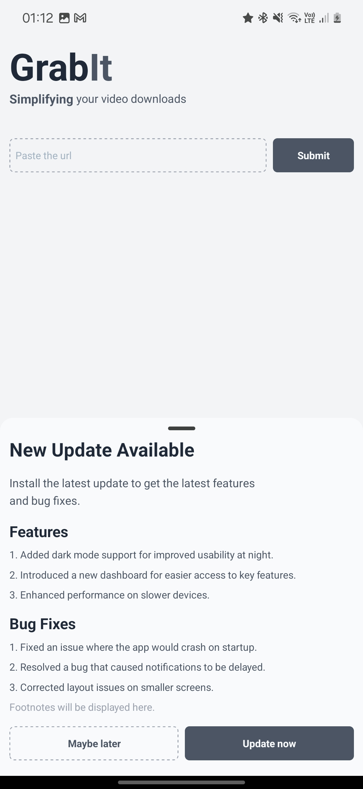
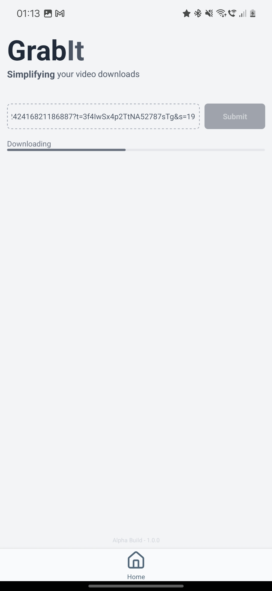
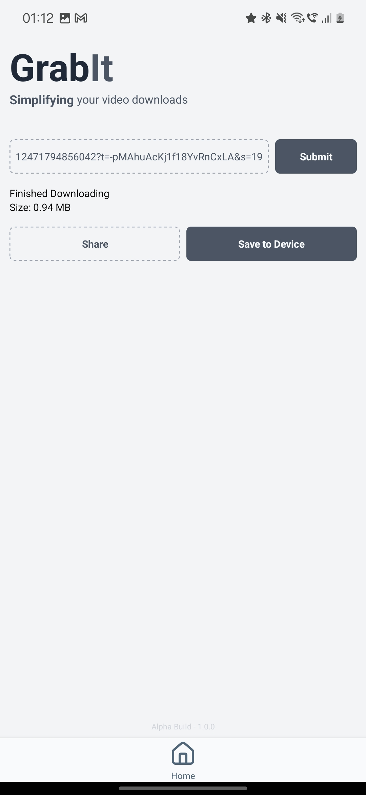

# GrabIt - Simplify Your Downloads

**GrabIt** is a React Native app built with Expo that lets you download videos effortlessly. Using the [Cobalt Tools API](https://cobalt.tools/), it provides a straightforward way to access and download videos from various sources directly to your device.

## Screenshots

  
  
  
  

## Features

-  **Download Videos Easily**: GrabIt connects to the Cobalt Tools API to facilitate video downloads.
-  **User-Friendly Interface**: Designed to be simple and intuitive for a seamless user experience.

Not developing further cause I kept running into axios network error during production build. Though I want to work on it, it's time to move on as it requires a backend server to fetch the video url. If I find anything which can be done locally then I'll come back to it.

Special mention this [@samansayar/media-downloader](https://github.com/samansayar/media-downloader) repo.

Let me know if you want to work with me.
Thanks and have a good one.
